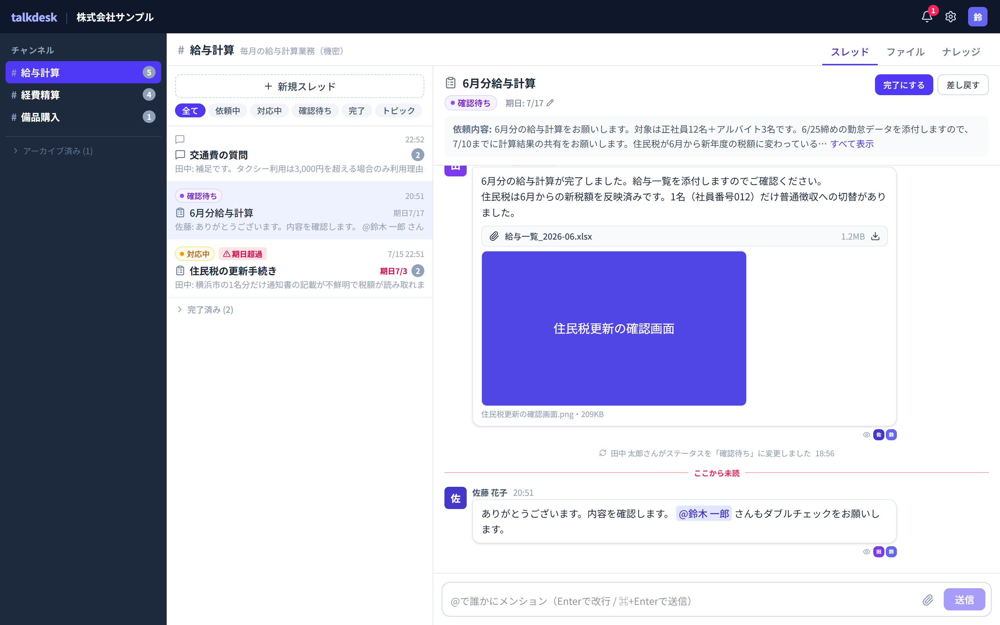
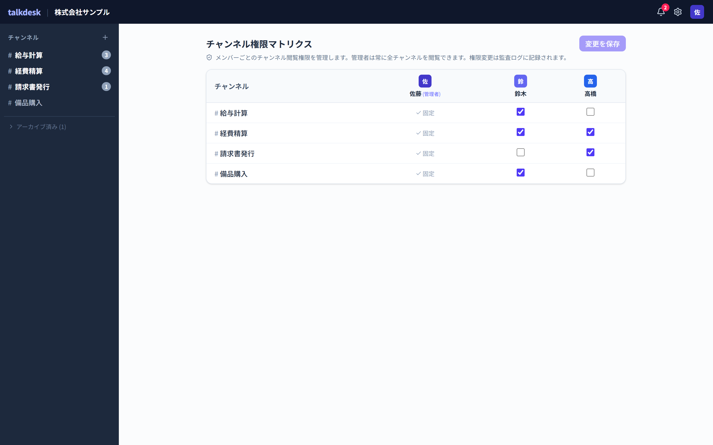
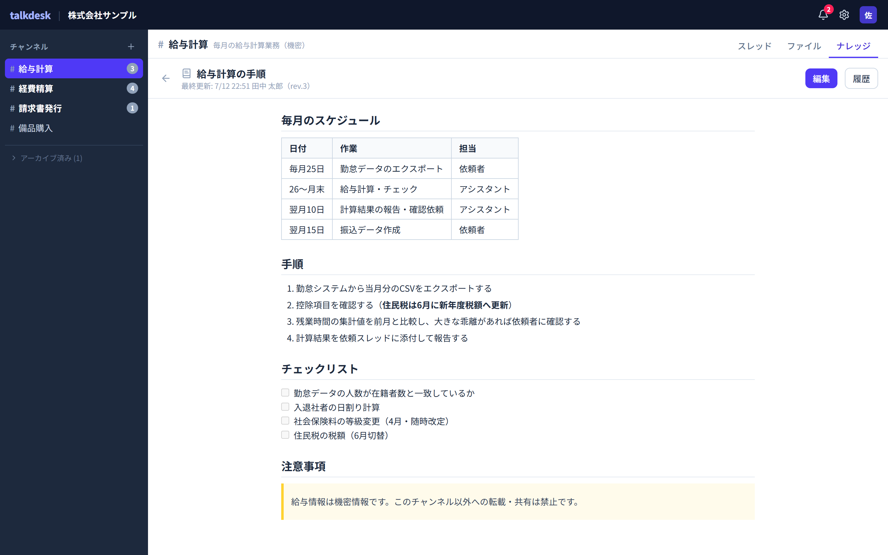
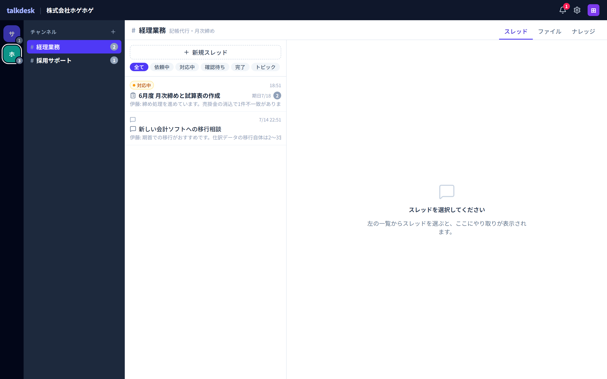

# talkdesk

中小企業が庶務・経理・労務などの定型業務をオンラインアシスタントにアウトソースするための、業務コミュニケーションツール。

依頼・報告・成果物の受け渡しを「業務ごとのチャンネル」に集約し、過去のやり取りを辿りやすくします。汎用チャット（メールやSlack）と違い、**チャンネル単位の閲覧権限管理を前提に設計**しているため、給与や労務といった機密性の高い業務も、社内で見せる相手を絞ったうえで安心して依頼できます。



左から「チャンネル（業務）」「スレッド（依頼）」「メッセージ（やり取りと成果物）」の3カラム。依頼はステータス（依頼中／対応中／確認待ち／完了）と期日を持ち、期日超過は警告が出ます。成果物はスレッドに直接添付され、既読者・未読位置・メンションもひと目で分かります。

## 解決したい課題

- 依頼がメール・チャット・電話に散らばり、**何をどこまで依頼したか追えない**
- 過去の依頼内容や成果物を探すのに時間がかかる
- 汎用チャットでは**給与情報などを見せたくない社員にも見えてしまう**
- アシスタントが交代するたびに業務の手順を一から説明し直す必要がある

## コンセプト

### 情報構造: チャンネル > スレッド > メッセージ

```
Organization（顧客企業）
 └─ Channel（業務単位。例:「給与計算」「経費精算」）★閲覧権限の管理単位
     ├─ Page（ナレッジページ: 業務マニュアル。ストック情報）
     └─ Thread（依頼 or トピック）★依頼はステータスを持つ
         └─ Message（発言・成果物の添付）
```

- **チャンネル＝業務**。長寿命の入れ物で、閲覧権限はここで管理します
- **スレッド＝依頼**。個々の依頼はステータス（依頼中→対応中→確認待ち→完了）を持ち、チャンネル内のスレッド一覧が「過去の依頼履歴」そのものになります。依頼に紐づかない質問はトピックスレッドとして扱います
- **ナレッジページ**。フロー情報（スレッド）とは別に、業務マニュアルをMarkdownでストックできます。編集履歴つき。依頼のやり取りで固まった手順をマニュアルに昇華させ、アシスタント交代時の引き継ぎコストを下げます

### 登場人物

| ロール | 説明 |
|---|---|
| 依頼者（メンバー） | 顧客企業の社員。閲覧権限を付与されたチャンネルだけが見える |
| クライアント管理者 | 顧客企業の経営者。自社の全チャンネルを閲覧でき、メンバー招待・権限管理を行う |
| アシスタント | 運営側のオペレーター。アサインされた企業のチャンネルのみ見える（最大10社） |
| 運営管理者 | サービス運営者。企業アカウントの発行とアシスタントのアサインを行う |

### 権限モデル（本プロダクトの肝）

1. **企業間の分離が最優先** — 依頼者は自社のデータ以外に一切アクセスできない
2. **チャンネルはデフォルト非公開** — 依頼者は明示的に権限を付与されたチャンネルだけ見える（例:「給与計算」は経営者と労務担当だけ）
3. **アシスタントは企業単位** — アサインされた企業の全チャンネルが見える
4. **認可はAPI層で強制** — UIの出し分けではなく、一覧・取得・ファイルURL発行・WebSocket購読のすべてで検証する



クライアント管理者は、メンバー×チャンネルの閲覧権限をマトリクスで一括管理します。上の例では「給与計算」は鈴木だけが閲覧でき、高橋には見えません（権限のないチャンネルは一覧にも表示されません）。管理者は常に全チャンネルを閲覧でき、権限変更は監査ログに記録されます。

### ナレッジページ



チャンネルごとに業務マニュアルをMarkdownで蓄積できます（表・チェックリスト対応）。編集履歴（rev）を持ち、過去版の閲覧・復元が可能。依頼のやり取りで固まった手順をここに集約することで、アシスタント交代時の引き継ぎコストを下げます。

### アシスタントの複数社対応



アシスタントは最大10社を担当します。左端の企業レール（Slackのワークスペース切替に相当）で担当企業を切り替えると、チャンネル一覧ごと表示が入れ替わります（上の例は2社目の株式会社ホゲホゲ）。未読は企業単位のバッジに集約されるため、表示していない企業の新着も見落としません。なお依頼スレッドを開くと、アシスタントには「対応中にする／確認待ちにする」だけが表示され、完了の承認は依頼者側にのみ表示されます。

## 現在の状態

**フロントエンドのモック（バックエンド未接続）が動作します。** 設計はドキュメントとして一通り揃っており、次のステップはGo APIの実装とモックAPI層の差し替えです。

- ✅ 設計ドキュメント（プロダクト設計・要件・DB設計・画面仕様・技術選定）
- ✅ フロントエンドモック（React SPA / in-memoryのモックAPI・4ロールをデモユーザーで切替可能）
- ⬜ バックエンド（Go API）
- ⬜ インフラ（Terraform / GCP）

## リポジトリ構成

```
talkdesk/
├── docs/     設計ドキュメント
├── web/      フロントエンド（React SPA・モック）
├── server/   Go APIサーバー（未着手）
└── infra/    Terraform（未着手）
```

## ドキュメント

| ドキュメント | 内容 |
|---|---|
| [docs/product-design.md](docs/product-design.md) | プロダクト設計（コンセプト・ドメインモデル・権限モデル・MVPスコープ） |
| [docs/requirements.md](docs/requirements.md) | 要件定義（サイトマップ・機能要件・非機能要件・決定履歴） |
| [docs/frontend-spec.md](docs/frontend-spec.md) | 画面仕様の正（全ルート・ワイヤーフレーム・画面別の要件ID） |
| [docs/database-design.md](docs/database-design.md) | DB設計（ER図・テーブル定義・認可ロジック） |
| [docs/tech-stack.md](docs/tech-stack.md) | 技術選定（GCP構成・ライブラリ選定と理由） |

## 技術スタック

| 領域 | 採用 | 理由 |
|---|---|---|
| フロントエンド | React + TypeScript + Vite（**CSR**） | 全画面ログイン必須でSEO不要。デスクトップ/ネイティブへのWebview搭載にCSRが有利 |
| UI | Tailwind CSS / lucide-react | — |
| バックエンド | Go（chi / coder/websocket / pgx + sqlc） | 並行処理・WebSocketとの相性、Cloud Runとシングルバイナリが好相性 |
| DB | Cloud SQL for PostgreSQL | 単一DB + `organization_id` でテナント分離 |
| インフラ | GCP（Cloud Run / GCS / Memorystore / Identity Platform） | — |
| 通知 | メール（SendGrid）+ WebPush | — |

将来的にデスクトップアプリ・ネイティブアプリへWebviewで展開する前提のため、SPAはプラットフォーム固有APIに直接依存させず、通知などは抽象化レイヤーを挟みます。

## フロントエンドモックの起動

```bash
cd web
npm install
npm run dev      # http://localhost:5173
```

ログイン画面のデモユーザーカードから、4つのロール（依頼者 / クライアント管理者 / アシスタント / 運営管理者）を切り替えて権限の出し分けを体験できます。

詳細・モックの既知の割り切りは [web/README.md](web/README.md) を参照してください。
