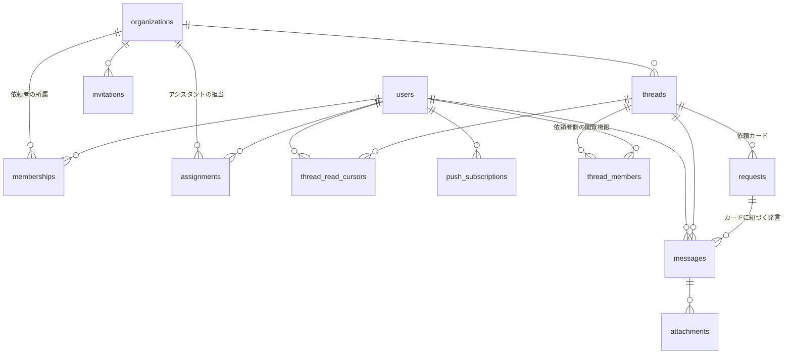

# talkdesk データベース設計

PostgreSQL 16。主キーはすべて UUIDv7（時系列ソート可能、アプリ側で生成）。
全テーブルに `created_at` / `updated_at` を持つ（以下では省略）。

## ER図



## テーブル定義

### users

| カラム | 型 | 備考 |
|---|---|---|
| id | uuid PK | |
| idp_uid | text UNIQUE | Identity Platform のUID |
| email | text UNIQUE | |
| display_name | text | |
| role | enum: `client` / `assistant` / `ops_admin` | システム全体のロール |
| avatar_url | text NULL | |
| disabled_at | timestamptz NULL | 無効化（退職等）。非NULLなら全アクセス拒否 |

### organizations

| カラム | 型 | 備考 |
|---|---|---|
| id | uuid PK | |
| name | text | |
| icon_url | text NULL | アシスタントの企業レール用 |

### memberships（依頼者の所属。1ユーザー1社）

| カラム | 型 | 備考 |
|---|---|---|
| id | uuid PK | |
| organization_id | uuid FK | |
| user_id | uuid FK UNIQUE | UNIQUEにより依頼者は1社のみ所属 |
| org_role | enum: `admin` / `member` | クライアント管理者 / 一般 |

### assignments（アシスタントの担当企業）

| カラム | 型 | 備考 |
|---|---|---|
| id | uuid PK | |
| organization_id | uuid FK | |
| user_id | uuid FK | UNIQUE(organization_id, user_id) |

- 1人最大10社はアプリ層で担保（INSERT時に `SELECT count(*) ... FOR UPDATE` で検査）

### threads

| カラム | 型 | 備考 |
|---|---|---|
| id | uuid PK | |
| organization_id | uuid FK | |
| name | text | 例:「給与計算」 |
| description | text NULL | |
| archived_at | timestamptz NULL | 業務終了時のアーカイブ |

### thread_members（依頼者側の閲覧権限）

| カラム | 型 | 備考 |
|---|---|---|
| id | uuid PK | |
| thread_id | uuid FK | |
| user_id | uuid FK | UNIQUE(thread_id, user_id) |

- **依頼者(member)のみ行を持つ**。クライアント管理者・アシスタント・運営は行を持たずに閲覧できる（閲覧可否の判定ロジックは下記）

### requests（依頼カード）

| カラム | 型 | 備考 |
|---|---|---|
| id | uuid PK | |
| thread_id | uuid FK | |
| title | text | |
| body | text | 依頼内容 |
| due_date | date NULL | |
| status | enum: `open` / `in_progress` / `in_review` / `done` | 依頼中/対応中/確認待ち/完了 |
| created_by | uuid FK(users) | |
| completed_at | timestamptz NULL | |

### messages

| カラム | 型 | 備考 |
|---|---|---|
| id | uuid PK | UUIDv7なのでスレッド内の時系列ソート・差分取得のカーソルを兼ねる |
| thread_id | uuid FK | |
| organization_id | uuid FK | threadsと重複するが**テナント境界の多層防御**として持つ |
| request_id | uuid FK NULL | 依頼カードへのコメントの場合に設定 |
| user_id | uuid FK NULL | システムメッセージはNULL |
| type | enum: `chat` / `system` | systemはステータス変更等の自動投稿（FR-R4） |
| body | text | |
| edited_at | timestamptz NULL | 編集済みラベル用 |
| deleted_at | timestamptz NULL | 削除痕跡（FR-H5）。削除時にbodyは空文字化、添付は物理削除 |

- INDEX: `(thread_id, id)` — スレッド内ページング・差分取得用

### attachments

| カラム | 型 | 備考 |
|---|---|---|
| id | uuid PK | |
| message_id | uuid FK | |
| file_name | text | |
| content_type | text | |
| size_bytes | bigint | 上限100MB（FR-F3、アプリ層で検査） |
| gcs_object_key | text | 実体はGCS。`org/{org_id}/thread/{thread_id}/...` |

### thread_read_cursors（既読管理）

| カラム | 型 | 備考 |
|---|---|---|
| thread_id | uuid FK | PK(thread_id, user_id) |
| user_id | uuid FK | |
| last_read_message_id | uuid | このID以下のメッセージは既読 |
| read_at | timestamptz | |

- **メッセージ×ユーザーの既読行は作らない**（行数爆発を防ぐ）。「誰が読んだか」（FR-H3b）は `last_read_message_id >= 対象メッセージID` のユーザー集合として導出する（UUIDv7の時系列性を利用）。Slackと同じカーソル方式
- 未読数 = カーソルより新しいメッセージ数。スレッド一覧のバッジはこのカウントをRedisにキャッシュ

### invitations

| カラム | 型 | 備考 |
|---|---|---|
| id | uuid PK | |
| organization_id | uuid FK NULL | アシスタント・運営招待の場合NULL |
| email | text | |
| role | enum | 招待後のロール（client member/admin, assistant, ops_admin） |
| token | text UNIQUE | 招待リンク用。有効期限7日 |
| expires_at | timestamptz | |
| accepted_at | timestamptz NULL | |

### push_subscriptions（WebPush）

| カラム | 型 | 備考 |
|---|---|---|
| id | uuid PK | |
| user_id | uuid FK | |
| endpoint | text UNIQUE | |
| keys_p256dh / keys_auth | text | VAPID用 |

### notification_settings

| カラム | 型 | 備考 |
|---|---|---|
| user_id | uuid PK FK | |
| email_enabled | boolean | |
| webpush_enabled | boolean | |
| digest_delay_minutes | int | 未読が残ったらN分後に通知（既定10分） |

### audit_logs（NFR-3）

| カラム | 型 | 備考 |
|---|---|---|
| id | uuid PK | |
| actor_user_id | uuid | |
| organization_id | uuid NULL | |
| action | text | `permission.grant` / `member.disable` / `ops.view_thread` 等 |
| target | jsonb | 対象の識別情報 |
| created_at | timestamptz | 追記のみ。UPDATE/DELETE権限をアプリDBユーザーに与えない |

## スレッド閲覧可否の判定（認可の中心ロジック）

```
can_view(user, thread):
  org = thread.organization_id
  1. user.role = ops_admin                         → 可（audit_logsに記録）
  2. user.role = assistant
       and assignments(user, org) が存在            → 可
  3. memberships(user, org).org_role = admin        → 可
  4. memberships(user, org) が存在
       and thread_members(thread, user) が存在      → 可
  それ以外                                          → 不可
```

- この判定をSQL関数ではなく**Goの単一の認可モジュールに集約**し、スレッド取得・メッセージ取得・ファイルURL発行・WebSocket購読のすべてが必ず通る構造にする（NFR-1）
- 一覧系クエリは同じ条件をWHERE句に埋め込んだsqlcクエリとして実装し、単体テストで認可モジュールと突き合わせる

## 未決事項

- メッセージ全文検索（将来）: PostgreSQLの`pg_trgm`で始め、規模が出たら外部検索エンジンを検討
